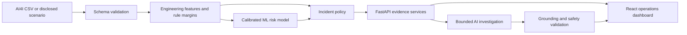

# Industrial Intelligence Copilot

An evidence-first industrial operations prototype for monitoring machine conditions, detecting failure risk, investigating incidents with a bounded AI copilot, and comparing proposed operating points before an engineer acts.

The system combines transparent engineering rules, calibrated machine-learning risk estimates, statistical evidence, similar-condition retrieval, and optional Groq or Gemini language-model explanations. Numerical claims are calculated by backend tools; the language model plans permitted evidence checks and communicates verified results.

## What the product does

- Replays original AI4I observations or runs disclosed OSF, HDF, and PWF scenarios.
- Streams machine telemetry through a live operational twin.
- Calculates temperature delta, mechanical power, overstrain load, and engineering-rule margins.
- Estimates calibrated machine-failure risk with persisted scikit-learn pipelines.
- Opens incidents from deterministic policy thresholds and preserves their evidence context.
- Compares recent telemetry with a baseline window.
- Retrieves similar AI4I operating conditions and reports their observed outcomes.
- Lets an operator ask Quick or Deep incident questions through a constrained AI workflow.
- Recalculates proposed what-if settings through the same backend model and rules.
- Creates local maintenance-action drafts without issuing machine commands.

## System architecture



The implementation follows a calculation-first design:

1. Backend code validates inputs and calculates evidence.
2. Registered tools expose only approved analytical operations.
3. The AI planner may select from those permitted tools.
4. The model receives compact evidence atoms, not unrestricted data or code access.
5. Grounding checks validate the generated answer against the evidence ledger.
6. Provider errors or invalid output trigger a verified deterministic fallback.

## Repository layout

```text
industrial-intelligence-copilot/
├── data/                    # AI4I source data and data notes
├── docs/                    # Domain, logic, math, and provider setup
├── frontend/                # React and Vite operations dashboard
├── models/                  # Persisted calibrated model pipelines and metadata
├── notebooks/               # Reproducible exploratory analysis
├── scripts/                 # Data, analysis, model, and preview utilities
├── src/industrial_copilot/  # Python application package
│   ├── analytics/           # Descriptive analytics and charts
│   ├── api/                 # FastAPI routes and request schemas
│   ├── copilot/             # Evidence-first conversation service
│   ├── data/                # Loading, schema, and audit logic
│   ├── features/            # Engineering feature calculations
│   ├── knowledge/           # Versioned domain knowledge and retrieval
│   ├── llm/                 # Groq/Gemini clients and structured contracts
│   ├── ml/                  # Training, evaluation, persistence, prediction
│   ├── simulation/          # Replay, scenarios, incidents, and what-if logic
│   ├── statistics/          # Conditional and adjusted statistical evidence
│   └── tools/               # Validated tool registry
└── tests/                   # Unit, API, AI, scenario, and regression tests
```

## Dataset

The project uses the **AI4I 2020 Predictive Maintenance Dataset**, created by Stephan Matzka and published by the UCI Machine Learning Repository.

- 10,000 synthetic manufacturing observations
- Six operating inputs: product type, air temperature, process temperature, rotational speed, torque, and tool wear
- One overall machine-failure target
- Five failure-mode flags: TWF, HDF, PWF, OSF, and RNF
- DOI: [10.24432/C5HS5C](https://doi.org/10.24432/C5HS5C)
- License: [CC BY 4.0](https://creativecommons.org/licenses/by/4.0/)

The raw CSV is not edited. The loader validates its exact schema and renames source identifier `UDI` to application identifier `UID` only in memory. No raw row is removed, smoothed, imputed, or relabelled.

The live OSF, HDF, and PWF scenarios are clearly identified as synthetic scenarios derived from documented AI4I mechanisms. They are not presented as plant telemetry. AI4I Replay uses original dataset rows.

## Engineering and model logic

Calculated operating features include:

- Temperature delta: process temperature minus air temperature.
- Mechanical power: torque multiplied by angular velocity.
- Overstrain load: torque multiplied by tool wear.
- OSF margin: product-specific threshold minus overstrain load.
- HDF and PWF margins: distance from documented rule boundaries.

The ML layer uses leakage-safe inputs. `Machine failure` and all failure-mode flags are excluded from model features. Persisted Logistic Regression and Random Forest pipelines include preprocessing and probability calibration. The primary augmented Random Forest model achieved these held-out results on the reproducible split:

| Metric | Value |
|---|---:|
| PR-AUC | 0.871 |
| ROC-AUC | 0.978 |
| Brier score | 0.0076 |

These scores describe the synthetic benchmark split and are not claims of real-plant performance.

## AI copilot

The optional AI layer is fully integrated when enabled:

- **Quick** performs one bounded evidence round and returns a concise grounded response.
- **Deep** creates a structured investigation plan, runs permitted evidence checks, retrieves knowledge, and exposes a trace.

Answers can show their provider or fallback status, deterministic evidence, evidence atoms and authority, selected tools, investigation objective, knowledge references, grounding status, and limitations.

The AI cannot execute arbitrary Python, SQL, shell commands, or unknown tool names. It does not invent sensor readings, remaining useful life, root cause, or plant history. Provider failures fall back to deterministic evidence instead of breaking the workflow.

## Requirements

- Python 3.11+
- Node.js 18+
- npm

## Installation

From the repository root in PowerShell:

```powershell
python -m venv .venv
.\.venv\Scripts\Activate.ps1
python -m pip install --upgrade pip
python -m pip install -r requirements-dev.txt
python -m pip install -e .
```

Install the frontend:

```powershell
cd frontend
npm install
cd ..
```

If data or model artifacts are absent, recreate them with:

```powershell
.\.venv\Scripts\python.exe scripts\download_data.py
.\.venv\Scripts\python.exe scripts\train_models.py
```

## Configuration

Copy the example configuration and keep real secrets only in `.env`:

```powershell
Copy-Item .env.example .env
```

For Groq:

```dotenv
LLM_ENABLED=true
LLM_PROVIDER=groq
GROQ_API_KEY=
GROQ_MODEL=openai/gpt-oss-120b
```

Add the key only to `.env`. Never add it to `.env.example` or commit it. Provider instructions are in `docs/GROQ_SETUP.md` and `docs/GEMINI_SETUP.md`.

The frontend defaults to `/api`, which Vite proxies to FastAPI. Deployments can override this with `VITE_API_BASE_URL`; see `frontend/.env.example`.

## Run the application

Terminal 1 — backend:

```powershell
.\.venv\Scripts\python.exe -m uvicorn industrial_copilot.api.main:app --reload
```

- Health: `http://127.0.0.1:8000/health`
- API documentation: `http://127.0.0.1:8000/docs`

Terminal 2 — frontend:

```powershell
cd frontend
npm run dev
```

Open `http://localhost:5173/`.

## Typical workflow

1. Select OSF, HDF, PWF, or AI4I Replay.
2. Press **Start** and watch the telemetry and incident state evolve.
3. Review the incident reason, risk, margins, recent changes, and similar cases.
4. Choose **Quick** or **Deep**, then ask an incident question.
5. Inspect the evidence and investigation trace behind the answer.
6. Adjust the what-if controls and press **Recalculate proposed outcome**.
7. Review suggested checks and optionally create a local maintenance-action draft.
8. Switch scenarios; state and copilot conversation reset to the new context.

## API surface

Important routes include `GET /health`, `GET /dataset/summary`, `GET /audit`, `POST /analyze`, `POST /investigate`, `POST /live/state`, `POST /live/copilot`, `POST /live/what-if`, `POST /predict`, and `POST /similar`. The interactive page at `/docs` contains request and response schemas.

## Verification

```powershell
.\.venv\Scripts\python.exe -m pytest -q
.\.venv\Scripts\python.exe -m ruff check .
cd frontend
npm run build
```

Optional backend checks:

```powershell
.\.venv\Scripts\python.exe scripts\run_demo_checks.py
.\.venv\Scripts\python.exe scripts\run_statistics_demo.py
.\.venv\Scripts\python.exe scripts\run_offline_copilot_demo.py
```

## Reproducibility

- The loader enforces an exact schema contract.
- Training uses a fixed random seed and a stratified held-out split.
- Model metadata records features, metrics, thresholds, and calibration output.
- `scikit-learn==1.9.0` matches the distributed serialized artifacts.
- Synthetic scenarios and their triggering rules are deterministic and tested.
- AI answers retain deterministic evidence and provider/fallback status.

## Limitations and production considerations

- AI4I is synthetic, cross-sectional benchmark data, not timestamped plant history.
- Scenario telemetry is simulated; there is no PLC, historian, CMMS, or control-system connection.
- Similar AI4I observations are benchmark evidence, not real maintenance cases.
- Associations and model outputs do not establish root cause.
- The system does not estimate remaining useful life.
- What-if analysis does not send commands.
- Production requires site-specific validation, sensor and unit contracts, drift monitoring, authentication, authorization, audit retention, secret management, rate limits, an explicit CORS allowlist, observability, and human approval workflows.

## Additional documentation

- `docs/01_DOMAIN_AND_DATASET.md` — domain and column guide
- `docs/02_PROJECT_LOGIC_AND_AI.md` — calculations, models, and AI design
- `docs/MATH_AND_STATS_GUIDE.md` — statistical methods in plain language
- `docs/GROQ_SETUP.md` — Groq configuration and testing
- `docs/GEMINI_SETUP.md` — Gemini configuration and testing
