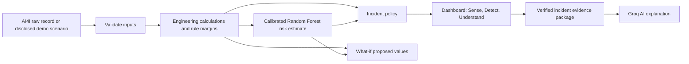

# 2. What the project calculates, predicts, and explains

## 2.1 The complete flow

The important order is: **calculate and verify first; ask the language model to explain second.**

## 2.2 Data preparation

1. Read the original CSV.
2. Check that the expected 14 columns are exactly present.
3. Rename source `UDI` to application `UID` only in memory.
4. Keep all 10,000 rows: no missing values needed filling and no duplicates needed deleting.
5. Create extra calculated columns in a copy of the data.
6. Train models using only values that would be available before a failure.

The target `Machine failure` and all five failure-mode flags (`TWF`, `HDF`, `PWF`, `OSF`, `RNF`) are deliberately excluded from the model’s input features. This prevents **target leakage**—the unfair situation where a model is given the answer in advance.

## 2.3 Feature engineering: calculations we added

No raw source column was deleted. These are new, calculated features.

| New feature | Formula | Plain meaning |
|---|---|---|
| Temperature delta | `process temperature − air temperature` | How much hotter the process is than its surroundings. |
| Angular velocity | `RPM × 2π / 60` | Converts turns per minute into radians per second. |
| Mechanical power | `torque × angular velocity` | How much rotational work is being done per second, in watts. |
| Overstrain load | `tool wear × torque` | A simple combined pressure indicator: worn tool plus turning force. |
| Overstrain threshold | L: 11,000; M: 12,000; H: 13,000 min Nm | Benchmark-specific limit used for the OSF rule. |

## 2.4 The transparent engineering rules

These rules are deterministic: the same input always gives the same result.

| Rule | It is true when | Interpretation |
|---|---|---|
| **HDF** (Heat Dissipation Failure) | temperature delta `< 8.6 K` **and** RPM `< 1380` | Thermal separation is low while rotation is low. |
| **PWF** (Power Failure) | mechanical power `< 3500 W` **or** `> 9000 W` | Power is outside the benchmark’s documented range. |
| **OSF** (Overstrain Failure) | overstrain load `>` the type threshold | Torque and tool wear together exceed the type-specific limit. |

TWF and RNF have random components in the benchmark, so the project does not pretend it can create a fully deterministic engineering rule for them.

### Rule margins

The UI shows not only whether a rule triggered, but how close the machine is:

- **OSF margin** = threshold − overstrain load. Positive is room left; negative means the threshold has been crossed.
- **HDF temperature margin** = temperature delta − 8.6 K.
- **HDF RPM margin** = RPM − 1380.
- **PWF margins** = distance from 3,500 W and 9,000 W.

This gives an engineer a reason to look at the warning instead of trusting a colour alone.

## 2.5 Machine learning

Four models were trained on a reproducible stratified split:

- 8,000 training records and 2,000 untouched test records.
- Random seed: 42.
- Each prediction is calibrated with sigmoid calibration using 3-fold cross-validation.
- Product type is one-hot encoded; numeric values are standardised in the model pipeline.

| Model | Features | PR-AUC | ROC-AUC | Brier score |
|---|---|---:|---:|---:|
| Logistic Regression | raw six operating inputs | 0.382 | 0.907 | 0.0258 |
| Random Forest | raw six operating inputs | 0.720 | 0.962 | 0.0159 |
| Logistic Regression | raw + three engineered features | 0.434 | 0.938 | 0.0249 |
| **Random Forest** | **raw + engineered features** | **0.871** | **0.978** | **0.0076** |

The bold row is the model used in the operational twin. It uses:

`Type, air temperature, process temperature, RPM, torque, tool wear, temperature delta, mechanical power, overstrain load`

### What the metrics mean

| Metric | Simple meaning | Why we use it |
|---|---|---|
| **PR-AUC** | How well the model finds rare positive/failure examples. Higher is better. | Failures are only 3.39%, so this is especially useful. |
| **ROC-AUC** | How well the model ranks failed above healthy records across thresholds. Higher is better. | Shows general separation ability. |
| **Brier score** | How close predicted probabilities are to real outcomes. Lower is better. | The dashboard shows a percentage risk, so calibration matters. |

The model output is a **calibrated benchmark risk estimate**, not a promise that a real machine will fail.

## 2.6 From a risk number to a visible incident

The operational twin combines the rules and model estimate:

| State | Meaning |
|---|---|
| NORMAL | No rule is triggered and risk is below 5%. |
| WATCH | Risk is at least 5%. |
| WARNING | A documented rule is active or risk is at least 15%. |
| INCIDENT | Risk is at least 35%. |

The incident engine also warns near rule boundaries, for example when OSF remaining margin is 1,000 min Nm or less. The policy is configurable; it is not hidden magic.

## 2.7 Why there are four demo scenarios

| Scenario | What it demonstrates | Is it real telemetry? |
|---|---|---|
| OSF | Torque and tool wear move toward the L-product overstrain boundary. | No; disclosed linear synthetic demo. |
| HDF | RPM and temperature delta move toward the heat-dissipation condition. | No; disclosed linear synthetic demo. |
| PWF | RPM/torque move toward high mechanical power. | No; disclosed linear synthetic demo. |
| AI4I Replay | A sequence of actual AI4I benchmark rows is replayed. | Real rows from a synthetic benchmark, not a live factory. |

The straight lines in OSF/HDF/PWF are intentional: they are controlled teaching scenarios, not sensor traces. Earlier zig-zag lines from the Lovable mock were placeholder visual noise and were not backend data. The replay can look less regular because it uses actual dataset rows.

## 2.8 What-if analysis

When a user moves a slider, the UI does **not** alter the current/real machine. It sends a proposed input to the backend. The backend creates a copy of the latest simulated reading and runs it through the same:

1. engineering-feature calculations,
2. rule checks and margins,
3. calibrated Random Forest risk estimate,
4. machine-status policy.

The Current-versus-Proposed panel is therefore a transparent decision-support comparison. The **Recalculate proposed outcome** button sends the selected values; it must be clicked after moving sliders.

## 2.9 The real AI layer: Groq Incident Copilot

The AI layer is active only when there is an incident and a valid Groq key/configuration. It is not a hard-coded answer bank.

### What happens when the user asks a question

1. The app gets the **current scenario and current cycle** from the backend.
2. It builds verified evidence: active incident, recent changes, rule margins, risk, and 8 nearest historical AI4I conditions.
3. The backend provides that evidence to Groq using the configured model, currently `openai/gpt-oss-120b`.
4. Groq creates readable explanation text under an evidence-only prompt.
5. The UI shows the model badge when AI text was generated, for example `Groq AI · openai/gpt-oss-120b`.

The current scenario is sent on every request. When you switch scenario/reset/start a new run, the frontend clears the old conversation so an OSF answer cannot be mistaken for an AI4I Replay answer.

### Why the AI is constrained

The Groq model is told to explain only supplied verified evidence. It may not invent readings, say one variable *caused* a failure, make up remaining useful life, or issue a machine command.

If Groq is unavailable, the app labels the response **Verified fallback**. The fallback comes from deterministic evidence logic, so the application remains reliable rather than inventing an answer. In a real demonstration, point out the badge—it honestly proves whether Groq generated the prose.

## 2.10 Similar historical conditions

For an incident, the backend finds 8 nearest AI4I observations using closeness in RPM, torque and tool wear. It reports how many of those historical benchmark records had a failure flag and the most common associated mode.

This is **similarity evidence**, not a prediction or a causal proof. “7 of 8 similar benchmark records failed” means the selected measurements resemble a risky group in AI4I; it does not mean a physical MACHINE-01 will fail 7/8 times.
